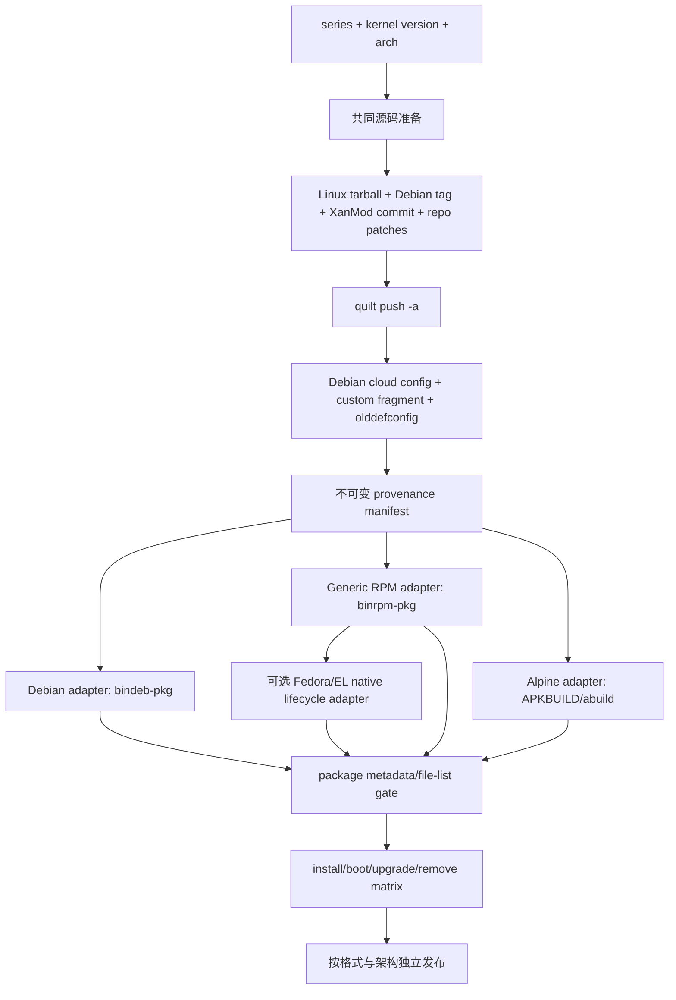

# RPM 与 APK 内核打包可行性调研

调研日期：2026-08-07  
适用项目：[Cloud-Kernel-BBRv3](../README.md)  
范围：在保持当前「Linux upstream 源码 → Debian kernel-team 补丁 → XanMod `net` 补丁 → 仓库自定义补丁/配置」的内核输入和顺序不变的前提下，调查 RPM 与 APK 的构建、发布和发行版集成可行性。报告最初是只读调研；文末建议与状态现已同步到随后完成的实现和本地验证结果。

## 结论摘要

1. **生成 `.rpm` 与 `.apk` 文件均可行，置信度高。**Linux upstream 提供 `rpm-pkg`、`srcrpm-pkg`、`binrpm-pkg`，但没有 APK target；APK 应由 Alpine 官方的 `abuild`/`APKBUILD` 生成。[上游 package targets](https://git.kernel.org/pub/scm/linux/kernel/git/stable/linux.git/plain/scripts/Makefile.package?h=v6.18.42)；[Alpine `APKBUILD(5)`](https://gitlab.alpinelinux.org/alpine/abuild/-/raw/master/APKBUILD.5.scd)。
2. **生成包文件不等于安全集成发行版。**后者另需验证包名和 `KERNELRELEASE` 共存、`/boot`、bootloader/BLS、initramfs、`depmod`、headers、模块签名、Secure Boot、升级、卸载和外部模块。当前 Debian `bindeb-pkg` 成功不能证明 RPM/APK 契约成立。
3. **推荐共同源码准备层 + 独立 package adapter。**继续唯一地使用现有 source/patch/config 流程；在其后分离 Debian、generic RPM、Fedora/EL native RPM（可选）和 Alpine `APKBUILD` adapter。不要把 Fedora/RHEL 或 Alpine 的完整下游 kernel policy 搬进项目。
4. **RPM 的首选渐进路径是 `binrpm-pkg` proof，再考虑自有 native spec。**完整 Fedora/RHEL spec 负责签名、`kernel-install`、`dracut`、BLS/UKI、module split、`installonlypkg` 与 EL `weak-modules`，原样移植会违背项目保持 Debian patch/config 输入的约束并造成高 rebase 成本。
5. **Alpine 首选自有、aports-style 的 `APKBUILD` adapter。**复用官方 `linux-lts` 的 package/install/header/initramfs 结构，而不复用其 source、patch 或 config policy。
6. **发布前默认不支持 Secure Boot、RHEL kABI 或跨 release 复用 DKMS module。**这些均需要独立密钥治理和目标机验证。RHEL 与 Rocky 官方都说明 vendor 不支持自定义编译 kernel。[RHEL](https://docs.redhat.com/en/documentation/red_hat_enterprise_linux/8/html-single/managing_monitoring_and_updating_the_kernel/index)；[Rocky](https://docs.rockylinux.org/10/guides/custom-linux-kernel/)。

| 路径 | 仅生成包 | 安全接入生命周期 | 推荐定位 |
|---|---|---|---|
| upstream `binrpm-pkg` | 高 | 中低 | 第一阶段 RPM technical proof |
| 自有 Fedora/EL native RPM adapter | 高 | 中，完成生命周期与签名测试后提高 | 有明确生产需求时采用 |
| staged tree + 最小 `abuild` | 高 | 低 | APK 原型对照，不直接发布 |
| aports-style 自有 `APKBUILD` | 高 | 中，需 boot matrix | 推荐 Alpine 路径 |

实现状态（2026-08-07）：已用 Linux 7.1.6 x86_64 完成共享 prepared tree、Fedora 44 native RPM、Alpine 3.24 APK 的完整构建；已检查主包/devel 包文件布局与 metadata，并在 disposable container 中完成 Fedora RPM 和 Alpine APK 的安装、initramfs/boot 文件生成、卸载清理。Alpine 包签名验证通过；RPM 当前未签名。尚未完成真实 VM 启动、升级、外部模块、Secure Boot，以及 Fedora 43、EL 9/10、arm64 的完整本地构建，因此 RPM/APK 仍应标记为 non-Secure-Boot experimental support。

## 当前仓库基线与复用边界

`docs/` 当前采用扁平调研布局，已有 [配置调研](cloud-kernel-config-optimization-research.md)，所以本报告置于 `docs/`，不新建无现有约定的 `docs/research/` 层级。

当前 [build workflow](../.github/workflows/build.yml) 的顺序为：下载 kernel.org tarball、克隆 Debian tag、克隆 XanMod patches、组织 `patches/series`、`quilt push -a`、合并 Debian cloud config 和仓库 fragment、`olddefconfig`、在 Ubuntu runner 上执行 `make bindeb-pkg`，只上传并发布 `.deb`、`.changes`、`.buildinfo` 和 `.config`。README 亦只声明 Debian/Ubuntu 支持。[源码/补丁/config 阶段](../.github/workflows/build.yml#L148-L231)；[Debian package/artifact 阶段](../.github/workflows/build.yml#L254-L324)；[README](../README.md#L12-L33)。

| 当前阶段 | 原样复用 | 边界 |
|---|---|---|
| Linux、Debian、XanMod 下载与版本选择 | 是 | 所有 package lane 必须使用相同 version/tag/commit。 |
| `patches/series` 与 `quilt push -a` | 是 | 与包格式无关，是共同 preparation stage。 |
| `apply_config.sh` + `olddefconfig` | 是，但仍为 Debian config 基线 | [脚本](../.github/scripts/apply_config.sh#L46-L84) 依赖 `linux-debian/debian/config` 的 generic、arch、cloud 层，再追加 `custom_configs/<series>/<arch>.config`；RPM/APK 可以消费最终 `.config`，但不能声称使用 Fedora/RHEL/Alpine 官方 config。 |
| `make bindeb-pkg` | 否 | 它是 Debian adapter；上游生成 `debian/` 并运行 `dpkg-buildpackage`，不是 RPM/APK 机制。[Makefile.package](https://git.kernel.org/pub/scm/linux/kernel/git/stable/linux.git/plain/scripts/Makefile.package?h=v6.18.42)；[`mkdebian`](https://git.kernel.org/pub/scm/linux/kernel/git/stable/linux.git/plain/scripts/package/mkdebian?h=v6.18.42)。 |
| artifact glob、release、`install-kernel.sh` | 否 | 调研时仅匹配 `.deb`，文案与安装器均为 Debian/Ubuntu-only；随后实现已增加 RPM/APK artifact、release 与发行版 dispatch。 |

### 当前 `bindeb-pkg` 的准确定位

当前使用的是 upstream 简化 Debian package generator，而非 Debian kernel-team 的完整 distro packaging rules。它生成 `linux-image-${KERNELRELEASE}`、`linux-headers-${KERNELRELEASE}`，按配置生成 `linux-libc-dev` 与 debug package；image 包含 modules，并让 maintainer scripts 通过 `/etc/kernel` 或 `/usr/share/kernel` 的 hooks 传递 `INITRD`。这解释它与 Debian/Ubuntu 的对接边界，也解释为何该行为不能自动移植至 RPM/APK。[`mkdebian`](https://git.kernel.org/pub/scm/linux/kernel/git/stable/linux.git/plain/scripts/package/mkdebian?h=v6.18.42)；[`builddeb`](https://git.kernel.org/pub/scm/linux/kernel/git/stable/linux.git/plain/scripts/package/builddeb?h=v6.18.42)。

## 必须区分的目标

| 目标 | 达成标准 | 不足以证明 |
|---|---|---|
| **构建格式产物** | CI 产生可解析 `.rpm`/`.apk`，包含 image、`/lib/modules/<KERNELRELEASE>` 和 headers | initramfs、boot entry、升级/卸载、Secure Boot 都正确 |
| **发行版集成安装包** | 对应 distro/arch 上 install、boot、回退、external module、upgrade、remove 及宣称的 Secure Boot 均通过 | 获得 RHEL/Rocky 厂商支持或 RHEL kABI 承诺 |

## RPM：upstream 与 Fedora/EL 原生路径

### 路径 A：upstream `rpm-pkg` / `binrpm-pkg`

Linux upstream 定义 `rpm-pkg`（source + binary RPM）、`srcrpm-pkg`（仅 source RPM）和 `binrpm-pkg`（仅 binary RPM），后者以 `rpmbuild --build-in-place --noprep` 处理已经准备好的 tree。[上游 package makefile](https://git.kernel.org/pub/scm/linux/kernel/git/stable/linux.git/plain/scripts/Makefile.package?h=v6.18.42)。

| target | 上游行为 | 对当前仓库的结论 |
|---|---|---|
| `rpm-pkg` | 依赖 `rpm-sources`；它生成 `linux.tar.gz`，而该 target 依赖 `check-git` | 当前 workflow 解压 kernel tarball 而没有建立 kernel Git worktree，故不能直接假定 SRPM 路径可用。 |
| `srcrpm-pkg` | 同样依赖 `rpm-sources` | 与 `rpm-pkg` 有相同 Git provenance 前置条件。 |
| `binrpm-pkg` | 在准备好的 working tree 生成 binary RPM | 最贴近既有可复用边界：应位于 `quilt push -a` 与最终 `.config` 之后；适合首先证明相同输入能产生 RPM。 |

generic `kernel.spec` 的确定结构如下：

- `Name: kernel`，并 `Provides: kernel-${KERNELRELEASE}`；
- 主包 stage image、`System.map`、`.config`、modules 与可选 DTB 到 `/lib/modules/${KERNELRELEASE}`；
- `kernel-headers` 提供 userspace headers；模块启用时可选 `kernel-devel` 提供 `/usr/src/kernels/${KERNELRELEASE}` 与 `/lib/modules/${KERNELRELEASE}/build`；
- `%post` 在存在 `/usr/bin/kernel-install` 时执行 `kernel-install add`，复制 image/`System.map`/config/DTB 到 `/boot`，并在需要时执行 `depmod`；`%preun` 有条件执行 `kernel-install remove`。

依据：[upstream generic `kernel.spec`](https://git.kernel.org/pub/scm/linux/kernel/git/stable/linux.git/plain/scripts/package/kernel.spec?h=v6.18.42)；[`mkspec`](https://git.kernel.org/pub/scm/linux/kernel/git/stable/linux.git/plain/scripts/package/mkspec?h=v6.18.42)。

这证明 generic RPM 的**产物可行性高**，但它不含 Fedora/EL 的 `kernel-core`/`kernel-modules` split、`installonlypkg`、`dracut` runtime prerequisite、EL `weak-modules`、发行版 Secure Boot 签名链和 release gates。因此不能将此路视为安全 Fedora/EL 集成。

#### generic RPM 构建宿主

upstream `mkspec` 要求 RPM `4.13` 以上；generic spec 列出 `bc`、`binutils`、`bison`、`dwarves`、`elfutils`/`libdw`、`libelf`、`flex`、`gcc`、`make`、`openssl`/`openssl-devel`、`perl`、`python3`、`rsync` 等 `BuildRequires`。应在 version-pinned Fedora/EL OCI image 且 target 同架构的 runner 中执行，不能将 Ubuntu 的 `apt` 依赖清单充当 RPM build contract。启用模块签名还需要 OpenSSL development files。[generic spec](https://git.kernel.org/pub/scm/linux/kernel/git/stable/linux.git/plain/scripts/package/kernel.spec?h=v6.18.42)；[module signing](https://git.kernel.org/pub/scm/linux/kernel/git/stable/linux.git/plain/Documentation/admin-guide/module-signing.rst)。

#### 本地 generic RPM proof（2026-08-07）

在当前已经应用 Debian、XanMod 与仓库补丁并完成配置/编译的 Linux 7.1.6 x86_64 tree 中执行：

```console
make -j16 CC="ccache gcc" HOSTCC="ccache gcc" binrpm-pkg
```

命令以状态 `0` 完成，耗时 `591.07s`，生成：

- `kernel-7.1.6-2.x86_64.rpm`
- `kernel-devel-7.1.6-2.x86_64.rpm`
- `kernel-headers-7.1.6-2.x86_64.rpm`

该结果直接证明相同 prepared tree 的 generic binary RPM 产物路径可行。它只覆盖构建，不覆盖目标 Fedora/EL 系统上的安装、`dracut`、BLS、boot、升级、卸载或签名。实测还暴露了发布阻断项：当前 `.config` 的 `CONFIG_LOCALVERSION=""` 使 `KERNELRELEASE` 为裸 `7.1.6`；generic spec 使用 stock `Name: kernel`，并让 `kernel-headers` obsoletes 较旧的 stock headers；构建另报告 `/lib/modules/7.1.6/build` absolute symlink warning。因此这三个 RPM 只能作为 technical proof，不得作为 release artifact。

### 路径 B：Fedora/RHEL 风格 `kernel.spec` + `rpmbuild`

Fedora 官方路径从 kernel SRPM 展开 `SPECS`/`SOURCES`，用 `dnf builddep kernel.spec` 安装依赖，再用 `rpmbuild -bb --target=<arch> kernel.spec`；文档要求 custom kernel 采用唯一 `buildid`，并用 `rpm -ivh` 安装以保留共存。[Fedora custom-kernel 指南](https://fedoraproject.org/wiki/Building_a_custom_kernel/Source_RPM)。

当前官方 [Fedora rawhide `kernel.spec`](https://src.fedoraproject.org/rpms/kernel/raw/rawhide/f/kernel.spec) 说明 native packaging 层负责：

- `kernel` meta 对 `kernel-core`、`kernel-modules`、`kernel-modules-core`、可选 `kernel-modules-extra` 的依赖，并声明 `installonlypkg(kernel)`；
- `systemd`、`/usr/bin/kernel-install` 与 `dracut` prerequisites；
- Fedora/RHEL/CentOS 条件分支、arch config、多个 flavour、UKI/SBAT、签名证书、庞大 BuildRequires；
- install 后的 `depmod`、EL `weak-modules --add-kernel`、`kernel-install add`，以及 remove 对称操作；
- 在 RPM strip/debug 之后 sign modules，最后压缩 modules，避免破坏签名。

RHEL 官方也明确描述 `kernel` meta、`kernel-core`、`kernel-modules`、`kernel-modules-extra`、`kernel-devel`、`kernel-abi-stablelists` 的不同职责。[RHEL package overview](https://docs.redhat.com/en/documentation/red_hat_enterprise_linux/8/html-single/managing_monitoring_and_updating_the_kernel/index)。

**建议：借鉴 native lifecycle adapter，不复制 distro kernel policy。**不得将 Fedora/RHEL config/patch tree 替换为现有 Debian config/patch 输入；若 generic RPM 已证明需求，再维护项目自有的、版本锁定的 `cloud-kernel` spec，明确 runtime dependency、分包、scriptlet 与 signing interface，并持续从当前 prepared tree 构建。不要复制 rawhide 全量 spec 后只改宏：它会同时引入 Fedora/RHEL 的 config、版本、签名与 rebase 权威来源。

Fedora 与 EL 必须分 lane；EL 按 major 分 lane，RHEL 最终验证只可在合法订阅和受控签名条件的私有 runner 进行。Rocky/CentOS Stream 可作为 EL 行为参考，不能替代 RHEL 签名链或厂商支持结论。完整 native integration 的初始置信度为**中**，因为机制可从一手源码确认，但本仓库尚无 adapter 或 boot evidence。

## Alpine：direct staging 与 aports-style adapter

upstream 没有 APK target，所以 APK 由 Alpine `abuild`/`APKBUILD` 负责。官方 `APKBUILD(5)` 定义 `pkgname`、`pkgver`、`pkgrel`、`arch`、`makedepends`、`depends`、`source`、`subpackages`、install scripts 和 triggers，并区分 `makedepends_build` 与 `makedepends_host`。[`APKBUILD(5)`](https://gitlab.alpinelinux.org/alpine/abuild/-/raw/master/APKBUILD.5.scd)。

### 路径 A：prepared tree 直接 stage + 最小 `APKBUILD`

在现有 patch/config 后把 image、`modules_install`、DTB stage 到 `pkgdir`，再让最小 `APKBUILD` 封装，技术上可以得到 APK，且不改变内核输入。它只适合 prototype：若未自行实现 `depends="initramfs-generator"`、`/lib/modules/<release>`、headers、initramfs trigger、bootloader entry、upgrade/remove 和 package naming，APK 仍可能“可安装而不可启动”。

### 路径 B：自有 aports-style `APKBUILD`（推荐）

官方 [`main/linux-lts/APKBUILD`](https://gitlab.alpinelinux.org/alpine/aports/-/raw/master/main/linux-lts/APKBUILD) 是应该借鉴的 native contract：

- `pkgname=linux-$_flavor`，`FLAVOR` 选择独立 flavour/config；
- 主包依赖 `initramfs-generator` 和 firmware package；
- 依赖包括 `installkernel`、OpenSSL、`pahole`、`bpftool` 等 kernel toolchain；
- 每 flavour/arch 使用独立 output directory、`olddefconfig` 与 flavour localversion；
- `_package()` 用 `modules_install` 和 `install`/`zinstall`/`dtbs_install` 安装 `/boot`、`/lib/modules`、`usr/share/kernel/<flavor>/kernel.release`，并创建 modules 下的 `vmlinuz` link；
- 拆出主包、`-dev`、`-doc`；`-dev` 包含 external module 的 headers/scripts、`Module.symvers`、`/lib/modules/<release>/build` link 以及可用时的 signing certificate；
- `CONFIG_MODULE_SIG` 时可提供 `KERNEL_SIGNING_KEY`；缺失时会生成 key，官方明确警告第三方 modules 无法用它签名。

[`mkinitfs` aport](https://gitlab.alpinelinux.org/alpine/aports/-/raw/master/main/mkinitfs/APKBUILD) `provides="initramfs-generator"`，并监视 `/lib/modules/*:/usr/lib/modules/*` trigger；[官方 initramfs 文档](https://wiki.alpinelinux.org/w/index.php?title=Mkinitfs) 说明 `mkinitfs` 以已填充的 `/lib/modules/<kernelvers>` 生成启动 initramfs。这使它们成为 APK adapter 的不可省略接口。

**项目约束：**使用全小写、自有 namespace 和 flavour，例如 `cloud-kernel-bbr` / `cloud-bbr`；不得替换 `linux-lts`、`linux-virt` 或其 `-dev` package。用 unique kernel release/flavour 让 `/boot`、`/lib/modules/<KERNELRELEASE>`、headers 和 boot entry 与 stock Alpine kernel 并存。保留当前 Debian config merge 的最终 `.config` 作为唯一 Kconfig 输入；只借鉴 Alpine packaging layout，不混入 Alpine LTS source/patch/config。不可用版本化 `provides` 假扮 `linux-lts`，也不可用 `replaces` 接管 stock files：前者作为 alias 会导致冲突，后者仅处理 file conflict。[`APKBUILD(5)`](https://gitlab.alpinelinux.org/alpine/abuild/-/raw/master/APKBUILD.5.scd)。

## 构建宿主与容器

| lane | 推荐宿主 | 必要条件 | 不应假定 |
|---|---|---|---|
| Debian（现有） | `ubuntu-24.04` / `ubuntu-24.04-arm` | 保留现有 `apt` 与 `dpkg-buildpackage` contract | 能提供 RPM/APK lifecycle |
| generic RPM | version-pinned Fedora/EL OCI image，x86_64/aarch64 分开 | `rpmbuild`、generic spec BuildRequires、同 target 架构 toolchain | 自动具备 Fedora/RHEL split、kABI 或 Secure Boot |
| Fedora native RPM | version-pinned Fedora image | 对应 SRPM/spec 的 `dnf builddep`、`kernel-install`、`dracut`、签名工具 | rawhide 能代表所有 Fedora/EL release |
| EL native RPM | 每个 EL major 单独 Rocky/CentOS Stream image；RHEL 私有验证 runner | EL macros、`dracut`、`kernel-install`、受控 signing material | Rocky/CentOS Stream 等价于 RHEL support 或 Secure Boot |
| Alpine APK | 目标 Alpine branch 的官方 OCI image，native x86_64/aarch64 runner | `abuild`、APKBUILD makedepends、`installkernel`、`initramfs-generator` | Ubuntu/Fedora 的 glibc dependency 可替代 Alpine/musl |

Rocky 官方指南列举 `Development Tools`、`ncurses-devel`、`openssl-devel`、`elfutils-libelf-devel`、`python3` 和 `dwarves`，并建议使用独立 `O=` output directory；它适合作为 EL bare-metal build 的最小参考，而不是 RPM package lifecycle 的完整说明。[Rocky guide](https://docs.rockylinux.org/10/guides/custom-linux-kernel/)。

## 包名、共存与升级策略

### 必须保持的不变量

1. 稳定发布建议每个 flavour 使用唯一 `KERNELRELEASE`，并记录 kernel tarball checksum、Debian tag/commit、XanMod commit、repo patch order/hash、final `.config` hash 与 package revision。当前实现按用户决定暂时保留 `CONFIG_LOCALVERSION=""`，因此这是明确记录的实验性例外，而非已满足的不变量。
2. package 名使用项目 namespace，不以 `kernel`、`linux-lts`、`linux-virt` 等 stock 名称发布稳定包。
3. 默认不声明替换 stock kernel 的 `Provides`、`Obsoletes`、`Conflicts` 或 APK `replaces`；默认可并存，允许用户从 bootloader 回退。
4. image、modules、headers、`Module.symvers`、DTB、initramfs 和 boot entry 必须使用同一个实际 release；若该 release 不是唯一值，安装文档与测试必须明确 collision/覆盖风险并保留 stock fallback。
5. 使用发行版的 install-only/retention policy 保留回退 kernel；generic spec 没有 Fedora/EL native 的完整 retention contract。

upstream generic RPM 的 `Name: kernel` 是冲突风险；Fedora 指南要求 unique `buildid`；Rocky 建议把 custom 标记加入 kernel release；Alpine recipe 通过 flavour/localversion 区分 kernel。上述来源共同证明“项目 namespace + unique release”仍是稳定发布的推荐前置条件。[generic spec](https://git.kernel.org/pub/scm/linux/kernel/git/stable/linux.git/plain/scripts/package/kernel.spec?h=v6.18.42)；[Fedora guide](https://fedoraproject.org/wiki/Building_a_custom_kernel/Source_RPM)；[Rocky guide](https://docs.rockylinux.org/10/guides/custom-linux-kernel/)；[Alpine `linux-lts`](https://gitlab.alpinelinux.org/alpine/aports/-/raw/master/main/linux-lts/APKBUILD)。

当前实现没有修改 config fragment，而是完整保留裸 `KERNELRELEASE`，并通过独立 package namespace、boot 文件名和明确的实验性支持声明降低误用风险。该选择不能消除 `/lib/modules/<release>` collision；真实 VM 验证期间必须保留发行版内核，稳定发布前应重新评估 flavour/localversion。

## 主要风险与控制

| 风险 | 影响 | 控制与发布门 |
|---|---|---|
| bootloader、BLS、UKI entry 缺失或删除错误 | install 成功但不可 boot；卸载删错 entry | RPM 测试 `kernel-install add/remove` 和 BLS；APK 测试本地 install contract；保留 stock fallback。[generic spec](https://git.kernel.org/pub/scm/linux/kernel/git/stable/linux.git/plain/scripts/package/kernel.spec?h=v6.18.42)；[Fedora spec](https://src.fedoraproject.org/rpms/kernel/raw/rawhide/f/kernel.spec)；[Rocky boot integration](https://docs.rockylinux.org/10/guides/custom-linux-kernel/) |
| initramfs 没有正确 modules | rootfs、存储、网络 early boot 失败 | Fedora/EL 验证 `dracut` output；Alpine 依赖 `initramfs-generator` 并验证 `mkinitfs`，覆盖 encrypted root、Virtio、NVMe。[Fedora spec](https://src.fedoraproject.org/rpms/kernel/raw/rawhide/f/kernel.spec)；[Alpine `linux-lts`](https://gitlab.alpinelinux.org/alpine/aports/-/raw/master/main/linux-lts/APKBUILD) |
| modules/headers 不匹配 | `modprobe`、DKMS、外部 module 失败 | 每个 release 有 `depmod`、`-devel`/headers、`Module.symvers`、build link；external module 按 exact `KERNELRELEASE` rebuild。[generic spec](https://git.kernel.org/pub/scm/linux/kernel/git/stable/linux.git/plain/scripts/package/kernel.spec?h=v6.18.42)；[RHEL module docs](https://docs.redhat.com/en/documentation/red_hat_enterprise_linux/8/html/managing_monitoring_and_updating_the_kernel/managing-kernel-modules_managing-monitoring-and-updating-the-kernel) |
| Secure Boot/module signing | firmware 拒绝 kernel，或 kernel 拒绝 module | 无 key custody、enrollment、EFI signing、module signing 与真实 UEFI evidence 前，明确“不支持 Secure Boot”。先 strip 后 sign。[RHEL Secure Boot](https://docs.redhat.com/en/documentation/red_hat_enterprise_linux/8/html/managing_monitoring_and_updating_the_kernel/signing-a-kernel-and-modules-for-secure-boot_managing-monitoring-and-updating-the-kernel)；[upstream signing](https://git.kernel.org/pub/scm/linux/kernel/git/stable/linux.git/plain/Documentation/admin-guide/module-signing.rst) |
| DKMS/kABI 误判 | module load failure、taint、升级后不可启动 | 不承诺 RHEL kABI；不要把 `weak-modules` 当作 custom kernel compatibility proof；每 release rebuild external modules。[RHEL module docs](https://docs.redhat.com/en/documentation/red_hat_enterprise_linux/8/html/managing_monitoring_and_updating_the_kernel/managing-kernel-modules_managing-monitoring-and-updating-the-kernel) |
| RPM debug/strip 在签名后执行 | `.ko` signature 被破坏 | sign 必须在 strip/debug 后；generic `mkspec` 对 module signing/debuginfo/RPM version 有专门限制，CI 必须检查它。[`mkspec`](https://git.kernel.org/pub/scm/linux/kernel/git/stable/linux.git/plain/scripts/package/mkspec?h=v6.18.42) |
| 将 EL 可启动误称为厂商支持 | 用户预期和支持边界错误 | 发布页写明“自定义、自维护”；不声称 RHEL/Rocky support。[RHEL](https://docs.redhat.com/en/documentation/red_hat_enterprise_linux/8/html-single/managing_monitoring_and_updating_the_kernel/index)；[Rocky](https://docs.rockylinux.org/10/guides/custom-linux-kernel/) |

RHEL 官方信任链要求 bootloader、kernel 和已加载 module 全部被系统信任 key 签名；启用 Secure Boot 或 `module.sig_enforce` 时，未验证 module 不可加载。上游说明 module signature 位于 ELF 外部，因此签名后不可 strip。此风险不是 package-format 问题，必须是单独的密钥与 UEFI 测试项目。[RHEL Secure Boot](https://docs.redhat.com/en/documentation/red_hat_enterprise_linux/8/html/managing_monitoring_and_updating_the_kernel/signing-a-kernel-and-modules-for-secure-boot_managing-monitoring-and-updating-the-kernel)；[upstream signing](https://git.kernel.org/pub/scm/linux/kernel/git/stable/linux.git/plain/Documentation/admin-guide/module-signing.rst)。

## 推荐 CI 分层



| 层 | matrix | 职责 | 发布条件 |
|---|---|---|---|
| `prepare` | `series × arch` | 锁定 kernel tarball、Debian tag、XanMod revision、repo patch order | 不发布 |
| `source-config` | `series × arch` | 重放现有下载、patch、config 流程，生成 final config digest 与 provenance manifest | 所有 package lane manifest 一致 |
| `package-deb` | `series × {x86_64,arm64}` | 保持 `bindeb-pkg` | 维持现有 Debian gate |
| `package-rpm-generic` | `series × arch × {Fedora,EL}` | generic binary RPM metadata/file-list proof | 仅实验 artifact |
| `package-apk` | `series × arch × Alpine branch` | 主包、`-dev`、`-doc` | 仅实验 artifact，直到 boot gate |
| `integration-rpm` | `{Fedora release,EL major} × arch × {BIOS,UEFI}` | install、initramfs、entry、`depmod`、boot、upgrade、remove | 任一目标失败阻止该目标发布 |
| `integration-apk` | `Alpine branch × arch × boot mode` | install、`mkinitfs`、boot、upgrade、remove、headers/external module | 同上 |
| `signing` | 受控 x86_64/aarch64 UEFI runner | key audit、image/module signing、MOK/`db` enrollment、Secure Boot boot | 未通过不得宣称 Secure Boot |

关键取舍：先按 package family 再按 distro 分隔；Fedora 与 EL 分 lane；Alpine branch 与 `abuild`/`mkinitfs` 固定；初期使用 native target-arch runner，不以 QEMU cross-emulation 作为 release blocker。发布 gate 至少覆盖 Virtio block/net、NVMe、ext4、BIOS/UEFI、reboot、stock fallback、下一 revision upgrade、旧 custom kernel remove 以及一个以 exact release 建立的 external module。

## 分阶段实施建议

### 阶段 0：冻结接口与 provenance

- 将现有 source/patch/config 过程定义为唯一 authoritative input。
- 冻结 package namespace、unique release、stock-kernel coexistence、Secure Boot 非支持默认值。
- 设计 build manifest：tarball checksum、Debian tag/commit、XanMod commit、patch path/hash、final `.config` hash、`KERNELRELEASE`、recipe revision。

**退出条件：**明确 no-replace/no-conflict 的并存策略及目标 distro/arch 集合。

### 阶段 1：只证明格式产物

- 在 Fedora/EL container 从同一 prepared tree 试验 `binrpm-pkg`，只标记 generic artifact。
- 用自有 aports-style `APKBUILD` 产出主包、`-dev`、`-doc`。
- 检查 metadata/file list 的 unique release image/modules/headers，确认无 stock file takeover。

**退出条件：**package manager 可以解析每个 artifact；没有启动或稳定发布承诺。当前 Fedora 44 RPM 与 Alpine 3.24 APK 已完成产物、metadata、安装和卸载的 container proof；其余 RPM target、arm64 与真实 boot matrix 仍待执行。

### 阶段 2：非 Secure-Boot 生命周期

- 在 Fedora、至少一个 EL major、Alpine 的 x86_64/aarch64 VM 完成 clean install、initramfs、boot、stock fallback、upgrade、remove。
- 验证 `modinfo`、headers/build link 和一个 exact-release external module。
- 若 generic RPM 在 `dracut`/BLS/upgrade 出现缺口，再做小型自有 native lifecycle adapter；不要直接复制 rawhide spec。

**退出条件：**只向通过的 distro/arch 发布 non-Secure-Boot experimental channel。

### 阶段 3：稳定发布

- `.deb`、`.rpm`、`.apk` 使用独立 release asset、checksum、安装说明与 retention/rollback 策略。
- 统一 `install-kernel.sh` 已按用户要求扩展为发行版 dispatch；只有通过识别与包管理器路径检查的 target 才进入对应 DEB/RPM/APK 安装逻辑，真实 VM 启动验证仍是稳定支持门槛。
- 将 install/uninstall scripts、headers、manifest 与 CI matrix 视为同一 release contract。

### 阶段 4：可选 Secure Boot 与 EL 深度集成

- 建立离线/受控 private key、certificate rotation/revocation、RPM/APK package signing、UEFI signing 机制。
- 实测 shim/MOK 或 firmware key enrollment、kernel image、initramfs/UKI（如适用）和所有 modules。
- 外部模块策略在每个声明的 EL major 验证后，才可考虑 `weak-modules`；仍不承诺 custom kernel 继承 Red Hat kABI。

## 最终推荐架构

1. 保持共同 preparation stage：所有格式从同一 Linux tarball、Debian patches、XanMod net patches、repo patches、Debian cloud merged config 产生；prepared archive 在保留最终 `.config` 的同时清除宿主机 helper binaries。
2. Debian adapter 保持 `bindeb-pkg`；统一安装器根据目标发行版分别选择 DEB、RPM 或 APK assets。
3. RPM 使用小型自有 Fedora/EL native spec，负责项目 namespace、`installonlypkg(kernel)`、modules/devel 布局以及 `kernel-install`/`dracut` 生命周期，不复制 Fedora/RHEL 完整下游 kernel policy。
4. Alpine 使用自有 **aports-style `APKBUILD`**，复用官方 `mkinitfs` trigger、`kernel-suffix`、modules/header 布局，但不 fork Alpine source/patch/config policy。
5. 默认不支持 Secure Boot、跨 release DKMS reuse 或 RHEL kABI；external module 以 exact `KERNELRELEASE` rebuild。RPM signing 也尚未实现。

**总体可行性：高。**“不改变当前内核输入而生成 RPM/APK”已由 Fedora 44/Alpine 3.24 x86_64 实包证明；“安全接入目标发行版生命周期”的置信度为中，因为 container install/remove 已通过，但真实 VM boot/upgrade、其余 RPM target 和 arm64 尚未验证。当前保留裸 `KERNELRELEASE` 是已知风险，不能用 package namespace 完全抵消。

## 第一方来源索引

### 当前仓库

- [README](../README.md)
- [build workflow](../.github/workflows/build.yml)
- [Debian config adapter](../.github/scripts/apply_config.sh)
- [既有调研](cloud-kernel-config-optimization-research.md)

### Linux upstream

- [package targets](https://git.kernel.org/pub/scm/linux/kernel/git/stable/linux.git/plain/scripts/Makefile.package?h=v6.18.42)
- [`mkspec`](https://git.kernel.org/pub/scm/linux/kernel/git/stable/linux.git/plain/scripts/package/mkspec?h=v6.18.42)
- [generic `kernel.spec`](https://git.kernel.org/pub/scm/linux/kernel/git/stable/linux.git/plain/scripts/package/kernel.spec?h=v6.18.42)
- [`mkdebian`](https://git.kernel.org/pub/scm/linux/kernel/git/stable/linux.git/plain/scripts/package/mkdebian?h=v6.18.42)
- [`builddeb`](https://git.kernel.org/pub/scm/linux/kernel/git/stable/linux.git/plain/scripts/package/builddeb?h=v6.18.42)
- [module signing](https://git.kernel.org/pub/scm/linux/kernel/git/stable/linux.git/plain/Documentation/admin-guide/module-signing.rst)

### Fedora / RHEL / Rocky

- [Fedora rawhide kernel dist-git spec](https://src.fedoraproject.org/rpms/kernel/raw/rawhide/f/kernel.spec)
- [Fedora custom kernel from SRPM](https://fedoraproject.org/wiki/Building_a_custom_kernel/Source_RPM)
- [RHEL kernel packages and lifecycle](https://docs.redhat.com/en/documentation/red_hat_enterprise_linux/8/html-single/managing_monitoring_and_updating_the_kernel/index)
- [RHEL module management and `weak-modules`](https://docs.redhat.com/en/documentation/red_hat_enterprise_linux/8/html/managing_monitoring_and_updating_the_kernel/managing-kernel-modules_managing-monitoring-and-updating-the-kernel)
- [RHEL Secure Boot signing](https://docs.redhat.com/en/documentation/red_hat_enterprise_linux/8/html/managing_monitoring_and_updating_the_kernel/signing-a-kernel-and-modules-for-secure-boot_managing-monitoring-and-updating-the-kernel)
- [Rocky custom kernel guide](https://docs.rockylinux.org/10/guides/custom-linux-kernel/)

### Alpine

- [aports `main/linux-lts/APKBUILD`](https://gitlab.alpinelinux.org/alpine/aports/-/raw/master/main/linux-lts/APKBUILD)
- [aports `main/mkinitfs/APKBUILD`](https://gitlab.alpinelinux.org/alpine/aports/-/raw/master/main/mkinitfs/APKBUILD)
- [`APKBUILD(5)`](https://gitlab.alpinelinux.org/alpine/abuild/-/raw/master/APKBUILD.5.scd)
- [`mkinitfs` documentation](https://wiki.alpinelinux.org/w/index.php?title=Mkinitfs)
